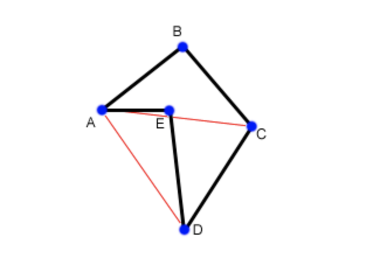

# Geometria Computacional para OBI

* Obs: O conteúdo desse texto é fortemente baseado no post "Geometry Concepts", por `lbackstrom - Topcoder Member`, disponível em `https://www.topcoder.com/community/competitive-programming/tutorials/geometry-concepts-basic-concepts/`.

Problemas de geometria computacional podem ser intimidadores, e não costumam aparecer tanto na OBI, porém quando aparecem é comum o participante precisar ter alguma afinidade com as técnicas e particularidades dessa área da computação para resolver o problema, o que pode ser um diferencial na hora da contagem de pontos.

Vamos apresentar alguns conceitos básicos neste primeiro texto, para nos familiarizarmos com a representação de alguns objetos geométricos fundamentais no computador.

## Vetores

Na geometria, formalmente um vetor é representado por uma magnetude e uma direção. No computador, basta dois pontos e uma direção para podermos descrever totalmente um vetor. Por exemplo, o segmento de reta que começa no ponto (1, 3) e termina em (5, 1) pode ser representado com um único par ordenado (x, y) que nos diz a magnetude e a direção do vetor, bastando utilizar a variação nas duas coordenadas: (4, -2). O que perdemos utilizando essa representação é o ponto inicial e final do vetor, mas podemos utilizar ambas as representações de acordo com o que precisamos no problema que estamos resolvendo.

### Operações básicas em vetores

Algumas operações comuns sobre vetores são facilmente implementadas no computador, como: _soma_, _produto escalar_ e _produto cartesiano_ (não tão simples quanto os outros).

A soma de dois vetores `(x1, y1)` e `(x2, y2)` é simplesmente `(x1 + x2, y1 + y2)`, uma operação que pode ser facilmente implementada (consumo de tempo O(número de coordenadas nos vetores)). Subtração é análoga.

Produtos escalares são particularmente úteis porque nos permitem encontrar _ângulos_ entre vetores. Por definição, um produto escalar de dois vetores `(x1, y1)` e `(x2, y2)` é dado por: `(x1 * x2) + (y1 * y2)`. Vale notar que esse calculo nos fornece um valor _escalar_, ou seja, um número apenas e não um vetor. Como na adição e na subtração, o produto escalar pode ser calculado diretamente. O que torna o produto escalar especialmente útil é a equação `A . B = |A||B|cos(θ)`, onde θ é o ângulo entre os dois vetores e |A| e |B| representam as _normas_ dos vetores A e B, facilmente calculadas: se `A = (x, y)` então `|A| = sqrt(x^2 + y^2)`. Assim, podemos calcular facilmente `cos(θ) = (A ⋅ B)/(|A||B|)`.

Produtos vetoriais são tão úteis quanto escalares, com a diferença de que eles nos resultam em um vetor e não em um valor escalar. Considerando vetores num plano 2D, `AxB = x1*y2 - y1*x2` A equação que relaciona o produto vetorial com o ângulo é: `A x B = |A||B|Sin(θ)`.

## Distância ponto-reta

Vamos resolver o problema de encontrar a distância entre um ponto dado no plano e uma reta. Para isso precisamos de pelo menos 3 pontos: 2 pontos A e B que dpertencem à reta que vamos considerar e 1 ponto C fora da reta. Primeiro precisamos calcular o tamanho dos vetores de A a B e de A a C, que vamos chamar de `AB` e `AC`, com isso basta calcular o produto vetorial desses dois vetores e dividir pelo tamanho de `AB`: `dist = (AB x AC)/AB`. Vale notar que o ponto da reta mais próximo de C pode não estar no segmento de reta AB. Também podemos obter um valor negativo de (AB x AC), nesse caso basta considerar o módulo.

Um trecho de código em C++ que implementa esse calculo:

```c++
//Compute the dot product AB ⋅ BC
int dot(int[] A, int[] B, int[] C){
  AB = new int[2];
  BC = new int[2];
  AB[0] = B[0]-A[0];
  AB[1] = B[1]-A[1];
  BC[0] = C[0]-B[0];
  BC[1] = C[1]-B[1];
  int dot = AB[0] * BC[0] + AB[1] * BC[1];
  return dot;
}
//Compute the cross product AB x AC
int cross(int[] A, int[] B, int[] C){
  AB = new int[2];
  AC = new int[2];
  AB[0] = B[0]-A[0];
  AB[1] = B[1]-A[1];
  AC[0] = C[0]-A[0];
  AC[1] = C[1]-A[1];
  int cross = AB[0] * AC[1] - AB[1] * AC[0];
  return cross;
}
//Compute the distance from A to B
double distance(int[] A, int[] B){
  int d1 = A[0] - B[0];
  int d2 = A[1] - B[1];
  return sqrt((d1*d1)+(d2*d2));
}
//Compute the distance from AB to C
//if isSegment is true, AB is a segment, not a line.
double linePointDist(int[] A, int[] B, int[] C){
  double dist = cross(A,B,C) / distance(A,B);
  return abs(dist);
}
```

## Calcular a área de um polígono (Seletiva)

* OBS: Baseado em https://en.wikipedia.org/wiki/Shoelace_formula

Vamos analisar o problema de encontrar a área de um polígono dados os pontos em torno de seu perímetro.

O método mais comum para calcular essa área é _triangular_ o polígino e depois calcular as áreas dos triângulos formados, utilizando a orientação dos vetores que formam os lados dos polígonos para compensar a área "extra" que calculamos.

Vamos considerar um polígono formado com 5 pontos (A, B, C, D, E). 



Com as linhas _vermelhas_, conseguimos formar os triângulos `ABC`, `ACD` e `ADE`. É claro que apenar somar a área de todos eles nos daria uma área maior do que a do polígono que estamos interessados, por isso vamos utilizar a propriedade de cálculo de área de triângulos com uso de produtos vetoriais pois a área "extra" deve ser naturalmente descontada. Primeiro, vamos calcular a área do triângulo `ABC`, que nos dá um valor _negativo_, graças à orientação dos pontos A, B e C. Adicionamos esse valor negativo na soma das áreas. Em seguida, calculamos a área do triângulo `ACD`, que também nos fornece um valor negativo. Agora, quando calcularmos a área do triângulo `AED`, obtemos um valor _positivo_, e somamos aos outros dois negativos. A soma das três áreas vão resultar em um número negativo. A área do polígono que estamos analisando é dada simplesmente pelo _módulo_ dessa soma, o que é facilmente verificado pela figura.

Segue o trecho de código em c++ que implementa esse cálculo:

```c++
int area = 0;
int N = lengthof(p);

//We will triangulate the polygon
//into triangles with points p[0],p[i],p[i+1] 

for(int i = 1; i+1<N; i++){
  int x1 = p[i][0] - p[0][0];
  int y1 = p[i][1] - p[0][1];
  int x2 = p[i+1][0] - p[0][0];
  int y2 = p[i+1][1] - p[0][1];
  int cross = (x1*y2) - (x2*y1);
  area += cross;
}

return abs(area/2);
```

## Intersecção de duas retas

Agora vamos analisar outro problema comum, encontrar o ponto de intersecção de duas retas num mesmo plano.

Primeiro, sabemos que uma reta pode ser facilmente descrita por uma equação do tipo `Ax + By = C`, onde A, B e C são constantes que caracterizam a reta. Porém, normalmente não recebemos linhas na forma de equações, mas sim pontos que pertencem a uma certa reta. Como já sabemos, se temos dois pontos no espaço, conseguimos encontrar a reta que contém ambos.

Sejam dados `(x1, y1)` e `(x2, y2)`. A partir desses pontos conseguimos obter as contantes A, B e C da equação acima, basta fazer:

```
A = (y2 - y1)
B = (x1 - x2)
C = (Ax1 + By1)
```

Independente da maneira com que a reta é fornecida, uma vez que temos duas retas descritas por:

```
A1x + B1y = C1
A2x + B2y = C2
```

Para encontrar o ponto onde elas se encontram basta resolver um sistema com as duas equações para as duas variáveis `x` e `y`.

Com algumas manipulações algébricas, conseguimos obter soluções para `x` e `y` e implementar:

```c++
double det = A1*B2 - A2*B1;
if (det == 0){
  //Lines are parallel
} else {
  double x = (B2*C1 - B1*C2)/det;
  double y = (A1*C2 - A2*C1)/det;
}
```

Assim conseguimos as coordenadas do ponto de intersseção de ambas as retas.

## Convex Hull

Primeiramente, vamos definir o que seria um _Convex Hull_ (envoltório convexo): um _convex hull_ de um conjunto de pontos é simplesmente o _menor_ polígono convexo que contém **todos** estes pontos.